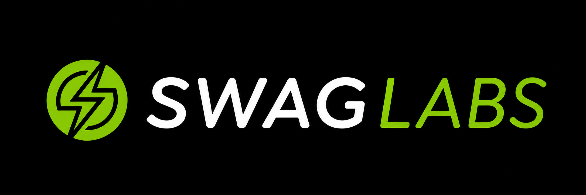

<p align="center">
  <a href="https://www.saucedemo.com" target="_blank">
    
  </a>
</p>

<h1 align="center">
SauceDemo Playwright Test Automation Framework
</h1>

<p align="center">


</p>

---

## 📖 Overview

This project is a UI test automation framework for the SauceDemo application built with **Python**, **Playwright**, and **Pytest**.

The framework follows the **Page Object Model (POM)** design pattern and provides automated end-to-end test scenarios covering the complete purchase flow.

---

## ⭐ Project Highlights

| Metric | Value |
|:--------|:-----:|
| Automated UI Tests | 22 |
| Page Objects | 6 |
| Browsers | Chromium • Firefox • WebKit |
| CI/CD | GitHub Actions |
| Reports | Allure |
| Containerization | Docker |

---

## ✨ Features

- Page Object Model (POM)
- Reusable BasePage
- Pytest Fixtures
- Test Data Separation
- Cross-browser Testing
- Allure Reporting
- Docker Support
- GitHub Actions CI

---

## 🛠 Tech Stack

- Python
- Pytest
- Playwright
- Allure Report
- GitHub Actions
- Docker

---

## 📁 Project Structure

```text
.
├── .github/
│   └── workflows/          # GitHub Actions workflows
├── config/                 # Configuration files
├── docs/                   # Project documentation and diagrams
├── framework/
│   └── base_test.py        # Base test configuration
├── pages/
│   ├── components/         # Reusable page components
│   ├── BasePage.py
│   ├── LoginPage.py
│   ├── InventoryPage.py
│   ├── CartPage.py
│   ├── CheckoutPage.py
│   ├── OverviewPage.py
│   └── OrderCompletePage.py
├── tests/                  # Automated test suites
├── conftest.py             # Pytest fixtures
├── Dockerfile
├── docker-compose.yml
└── requirements.txt
```

### 📂 Directory Overview

- **config/** – project configuration files.
- **docs/** – documentation, diagrams, and project assets.
- **framework/** – base test classes and shared test functionality.
- **pages/** – Page Objects and reusable UI components.
- **tests/** – automated UI test scenarios.
- **conftest.py** – shared Pytest fixtures and configuration.

---

## 🔄 Application E2E Test Flow

The automated test suite covers the following end-to-end user journey:

1. Login
2. Inventory
3. Cart
4. Checkout
5. Checkout Overview
6. Order Complete


---

## 🏗 Framework Architecture

The framework follows the **Page Object Model (POM)** design pattern.

```text
Tests
   │
   ▼
Page Objects
   │
   ▼
BasePage
   │
   ▼
Playwright
   │
   ▼
Browser
   │
   ▼
SauceDemo
```

### 📌 Responsibilities

- **Tests** contain business logic and assertions.
- **Page Objects** contain page actions and locators.
- **BasePage** contains reusable Playwright methods shared across all pages.

---

## ✅ Test Coverage

### 🔐 Login

- Valid login
- Invalid login
- Locked user validation

### 🛒 Cart

- Add product to cart
- Remove product from cart
- Add multiple products
- Remove one product from cart
- Cart badge validation

### 💳 Checkout

- Empty first name validation
- Empty last name validation
- Empty postal code validation
- Cancel checkout flow

### 📦 Checkout Overview

- Product validation
- Product description validation
- Quantity validation
- Payment information validation
- Shipping information validation
- Total price validation
- Price calculation validation
- Cancel order flow
- Finish order flow

### 🎉 Order Complete

- Success title validation
- Success message validation
- Back Home button validation
- Return to Inventory page validation

---

## ⚙️ Setup

### 🐍 Create Virtual Environment

```bash
python -m venv .venv
```

### ▶️ Activate Virtual Environment

#### 🪟 Windows

```bash
.venv\Scripts\activate
```

#### 🍎 macOS / 🐧 Linux

```bash
source .venv/bin/activate
```

### 📦 Install Dependencies

```bash
pip install -r requirements.txt
```

### 🌐 Install Playwright Browsers

```bash
playwright install
```

---

## ▶️ Running Tests

### 🚀 Run All Tests

```bash
pytest
```

### 🎯 Run Specific Test Suites

```bash
pytest tests/login
pytest tests/cart
pytest tests/checkout
pytest tests/overview
pytest tests/order_complete
```

### 👀 Run Tests in Headed Mode

```bash
pytest --headed
```

### 👀 🐢 Run Tests in Headed Mode with Slow Motion

```bash
pytest --headed --slowmo 500
```

---

## 📊 Allure Report

This project uses **Allure Report** for advanced test reporting and execution analysis.

The report includes:

- Test execution overview
- Features and stories
- Severity levels
- Step-by-step execution
- Test suites
- Execution timeline
- Historical trends (when history is preserved)

### 📈 Generate Allure Report

Run the helper script:

```bash
make allure
```

Or generate the report manually:

```bash
pytest --alluredir=allure-results

allure generate allure-results -o allure-report --clean

allure open allure-report
```

---

## 🎥 Demo

### 🎬 Test Execution

<p align="center">
  
</p>

### ⚡ GitHub Actions

<p align="center">
  
</p>

### 📊 Allure Report

<p align="center">
  
</p>

<p align="center">
  
</p>

---
## 🐳 Docker

### 🏗 Build Image

```bash
docker build -t saucedemo-tests .
```

### ▶️ Run Tests

```bash
docker run saucedemo-tests
```

---

## 🔄 CI/CD


The GitHub Actions pipeline automatically:

- Installs dependencies
- Installs Playwright browsers
- Executes the test suite
- Generates Allure Report
- Deploys Allure Report to GitHub Pages

---

## 👩🏼‍💻 Author

### **Agatha Abakumova**

#### QA Engineer

Python • Playwright • Pytest • Allure • GitHub Actions

- GitHub: https://github.com/aagaathaa
- LinkedIn: https://www.linkedin.com/in/agatha-abakumova-537322231/