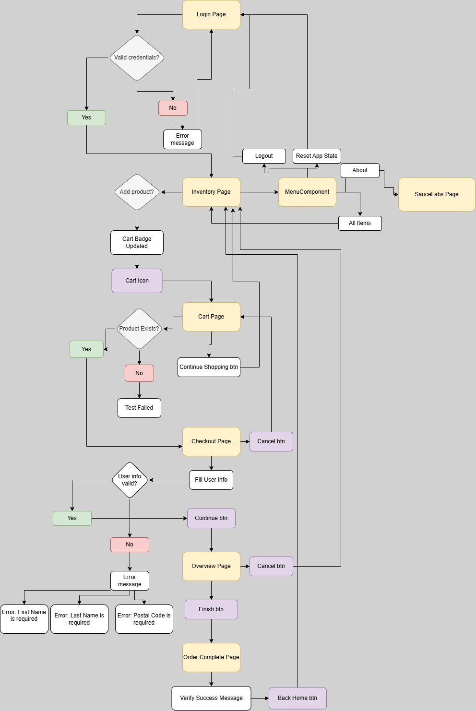

# SauceDemo Playwright Test Automation Framework

## Overview

This project is a UI test automation framework for the SauceDemo application built with Python, Playwright, and Pytest.

The framework follows the Page Object Model (POM) design pattern and includes automated end-to-end test scenarios covering Login, Cart, Checkout, Checkout Overview, and Order Complete flows.

---

## Tech Stack

* Python
* Playwright
* Pytest
* GitHub Actions
* Docker
* Page Object Model (POM)

---

## Project Structure

```text
project/
├── config/
├── framework/
├── pages/
├── tests/
│   ├── login/
│   ├── cart/
│   ├── checkout/
│   ├── overview/
│   └── order_complete/
├── docs/
├── .github/workflows/
├── Dockerfile
├── conftest.py
└── requirements.txt
```

---
## Application E2E Test Flow

The diagram below illustrates the end-to-end user journey covered by the automated test suite:

1. Login Page
2. Inventory Page
3. Cart Page
4. Checkout Page
5. Checkout Overview Page
6. Order Complete Page



## Framework Architecture

The framework follows the Page Object Model (POM) design pattern.

```text
Tests
   │
   ▼
Page Objects
   │
   ▼
BasePage
   │
   ▼
Playwright API
   │
   ▼
SauceDemo Application
```

Test classes contain assertions and business flows.

Page Objects contain page-specific actions and locators.

BasePage contains reusable Playwright methods used across all pages.

```
```


## Test Coverage

### Login

* Valid login
* Invalid login
* Locked user validation

### Cart

* Add product to cart
* Remove product from cart
* Add multiple products
* Cart badge validation

### Checkout

* Empty first name validation
* Empty last name validation
* Empty postal code validation
* Cancel checkout flow

### Checkout Overview

* Product validation
* Product description validation
* Quantity validation
* Payment information validation
* Shipping information validation
* Total price validation
* Price calculation validation
* Cancel order flow
* Finish order flow

### Order Complete

* Success title validation
* Success message validation
* Back Home button validation
* Return to Inventory Page validation

---

## Setup

Clone repository:

```bash
git clone https://github.com/aagaathaa/saucedemo-playwright-tests.git
cd saucedemo-playwright-tests
```

Create virtual environment:

```bash
python -m venv .venv
```

Activate environment:

```bash
.venv\Scripts\activate
```

Install dependencies:

```bash
pip install -r requirements.txt
```

Install Playwright browsers:

```bash
playwright install
```

---

## Running Tests

Run all tests:

```bash
pytest
```

Run specific test suite:

```bash
pytest tests/login
pytest tests/cart
pytest tests/checkout
pytest tests/overview
pytest tests/order_complete
```

Run with headed browser:

```bash
pytest --headed
```

---

## Docker

Build image:

```bash
docker build -t saucedemo-tests .
```

Run tests:

```bash
docker run saucedemo-tests
```

---

## CI/CD

GitHub Actions workflow automatically:

* Installs dependencies
* Installs Playwright browsers
* Executes automated tests
* Generates execution results

---

## Design Pattern

The framework follows the Page Object Model (POM) pattern:

* BasePage contains reusable actions
* Each application page has its own Page Object
* Tests contain only business logic and assertions
* Fixtures prepare application state for test execution

---

## Author

Agatha Abakumova

QA Engineer | Python | Playwright | Pytest